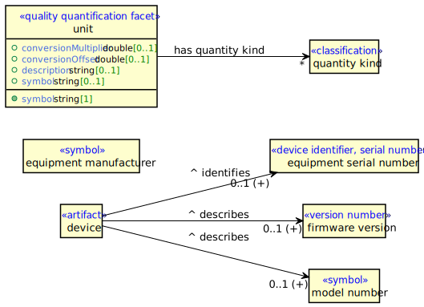
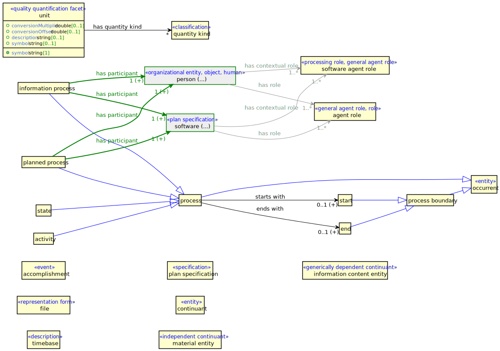

# What is this good for?
This tool generates a UML diagram out of given SHACL shapes and OWL ontology (files or folder + owl:imports closure of both). You can control which part of the ontology (classes and properties) to display and how.

# Quick start
**Build** a jar package by calling
```shell
mvn clean package
```

To directly render plantuml to images (i.e. to use output format `-f=svg`), you need to either:

**Install** [GraphViz](https://graphviz.org/download/) (tested on [Stable Windows install packages](https://www2.graphviz.org/Packages/stable/windows)), don't forget to add `path/to/Graphviz/bin` to `Path` and set `GRAPHVIZ_DOT` to `path/to/Graphviz/bin/dot.exe`.

Or use a PlantUML server by adding e.g. `-Dshacl2plantuml.plantuml.server=http://www.plantuml.com/plantuml` cmd option before `-jar ...` in the call examples below.
You can use a [public PlantUML server](http://www.plantuml.com/plantuml) or set up a [local PlantUML docker server](https://hub.docker.com/r/plantuml/plantuml-server/) and use `http://localhost:8080`.

**Run** e.g. 
```shell
java -jar shacl2plantuml-cmd/target/shacl2plantuml-cmd-1.0.0-SNAPSHOT-exec.jar 
     -s path/to/shapes/dir/or/file.ttl
     -v path/to/vocab/dir/or/file.ttl
     -d path/to/diagram_def.yaml 
     -o path/to/out/file/diagram.svg 
     -f svg 
```
the content of diagram_def.yaml being e.g.

```yaml
classes:
  - uri: ns:SomeClassFromTheModel
```

or skip -d option entirely.

### Command line arguments
```
 -f,--format <arg>       The format of the output file (plantuml | svg).
 -o,--output <arg>       The location of the output file. 
                         It will be created if it doesn't already exist.
 -s,--shapes <arg>       Location of the shapes file
 -v,--vocabulary <arg>   Location of the vocabulary/ontology file
 -d,--diagramDef <arg>   Optional. Location of the diagram definition file

```

### Output

#### PlantUML

When `--format (-f)` is set to `plantuml`, the output is generated in plantuml format.

The quick-start example would generate PlantUML file `diagram.wsd`. To render it, you can either:

- (easiest but slow) copy & paste content of `diagram.wsd` file to http://www.plantuml.com/plantuml/uml
- or download and use PlantUML jar from https://plantuml.com/download
- and/or download PlantUML extension for Visual Studio Code, set it up (see bellow), open `diagram.wsd` and press Alt+D to display / refresh the preview and right-click inside the .wsd file and select Export diagram to save it. To set up the extension, either:
  - set (easiest but slow)
    - `Plantuml: Render` = `PlantUMLServer`
    - `Plantuml: Server` = `http://www.plantuml.com/plantuml`
  - or set (faster)
    - `Plantuml: Render` = `PlantUMLServer`
    - `Plantuml: Server` = `http://localhost:8080`
    - and download and follow the manual to run PlantUML docker server https://hub.docker.com/r/plantuml/plantuml-server/
  - or (faster, my setup) set
    - `Plantuml: Render` = `local`
    - `Plantuml: jar` = path to PlantUML jar file
    - and install GraphViz: https://www.graphviz.org/download/

#### Image format

When `--format (-f)` is set to an image format (currently only `svg` is supported), `shacl2plantuml` uses the plantuml library to render the diagram as an image.
For this option, you *need* to perform the setup outlined above. Rendering can either be performed locally or using a PlantUML server - dockerized version available here: https://hub.docker.com/r/plantuml/plantuml-server.
Which of the two approaches is chosen depends on the setup of `shacl2plantuml.plantuml` configuration properties - see below. When rendering locally, PlantUML requires an external program called GraphViz to be installed.

# Examples

Following examples are from the existing ADM models. Calling

```shell
(...) 
-s adm/purl/shapes/adm/core/REC/2020/12/device.shapes.ttl 
-v afo/afo/voc/afo/merged/REC/2020/12/merged-and-inferred.ttl
```

outputs:


Calling

```shell
(...) 
-s adm/purl/shapes/adm/core/REC/2020/12/process.shapes.ttl 
-v afo/afo/voc/afo/merged/REC/2020/12/merged-and-inferred.ttl
```

outputs:


Now this is slightly complicated. Suppose we'd like to hide the indirect (light) superclass links (read below why and when they're displayed). We'd call

```shell
(...) 
-s adm/purl/shapes/adm/core/REC/2020/12/process.shapes.ttl 
-v afo/afo/voc/afo/merged/REC/2020/12/merged-and-inferred.ttl
-d process-definition.yaml
```

the content of `process-definition.yaml` being 

```yaml
hideIndirectSuperClassLinks: true
```

and we'll get


Now let's just focus on the information process and what it relates to and what that relates to... We'll change `process-definition.yaml` to

```yaml
expandOutLinks: true
classes:
  - uri: af-p:AFP_0000307
```

output:


That looks nice. Shall we have a look at its superclasses too?

```yaml
expandOutLinks: true
expandSuperClasses: true
classes:
  - uri: af-p:AFP_0000307
```

output:


Wow, that has actually transitively expanded superclasses of everything. Let's tame it a bit - 
we only want the direct supeclass of the information process. 

```yaml
expandOutLinks: true
classes:
  - uri: af-p:AFP_0000307
    expandSuperClasses: true
```

output:


# How are diagrams formed?

Unless configured otherwise (see bellow), direct superclass and property links between included classes are displayed as links. 
To improve readability, if an indirect superclass link is not obvious (intermediate hierarchy classes are not present), by default this indirect 
link is rendered as well, although in less bright color. 

Other properties are displayed as inner properties / attributes - their icon corresponds to cardinality (required = full, otherwise empty; multi = diamond, single = circle).

Super classes, that are not included (or if configured so) are listed as stereotypes of each class (direct only).

## Shacl constraints used

Put in simple words, the tool now focuses on objects of `sh:class` and `sh:targetClass` and uses property shapes
and ontological class hierarchy to identify and show links between classes. **Any class referenced in the shapes has to be defined in the ontology/vocabulary.** 

Note however that only constraints **that actually apply** are displayed! 
This means that when shapes do not have a target, and they are not used by any shape with a target, they don't constrain anything, 
and so these "library shapes" won't be displayed!

Currently, the following types of constraints are taken into account when forming the diagrams: properties affecting links to classes:
* `sh:class`
* `sh:targetClass`

Constraints influencing how properties are formed:
* `sh:property`

Constraints influencing the display of property object (other than `sh:class`):
* `sh:datatype`
* `sh:hasValue`

Constraints influencing cardinalities:
* `sh:minCount`
* `sh:maxCount`
* `sh:qualifiedMinCount`
* `sh:qualifiedMaxCount`

(+) behind the cardinality expression means that other objects of that property are allowed too. In technical terms, this means that `sh:qualifiedMin/MaxCount` + `sh:qualifiedValueShape` is used here.

Other constraints taken into account:
* `sh:qualifiedValueShape`
* `sh:node`
* `sh:and`
* `sh:or`
* `sh:xone`

Shapes connected by these are simply "flattened" on either side of sh:property - meaning they help to specify the subject or object of a property constraint. 
Note that specifically `sh:or` and `sh:xone` constraints are currently displayed in the same way as any logical conjunction.
This can cause confusion and should be a subject of future improvements. 

## Proper classes and shape-specific (context-specific) classes

Note that some class boxes are displayed in bright yellow colors where other are gray with green line around them. The yellow classes
are proper classes, meaning whenever an instance of that class occurs, all the listed property constraints apply.

The gray classes with green line are context-specific or shape-specific classes. The context is specified by the incoming green link.
That means that whenever an instance of the class occurs **in the given context**, only then all the listed property constraints (displayed as gray lines) apply.
If the shape is has a uri, this is shown in the brackets behind the class name, otherwise (...) is shown.

# Diagram Definition File

Files are structured as follows:

```yaml
name: xx
config_1: xx
config_2: yy
# ...
listedClasses:
  config_1: aa
  config_8: bb
  # ...
expandedClasses:
  config_2: dd
  config_8: ee
  # ...
classes:
  - uri: ns:MyClass1
    config_1: ff
    # ...
  - uri: ns:MyClass2
  # ...
```

All properties are optional, however note that if the list of classes is not present, the algorithm tries to determine the classes to show by inspecting objects of
`sh:class` and `sh:targetClass`. If you then choose to exclude some links or use expandXXX configs, this may result in awkward behaviour.

Here is a list of possible configurations. They can be specified on three levels, every config defaulting to the parent level if not set. At the top-most level, all booleans default to false.

For all classes listed in `classes`, class-level configuration is prioritized. If properties are not set here, the configuration defaults to `listedClasses` configuration.

For all the classes gained via expansion (gray ones in the pictures above), `expandedClasses` configuration is used.

For configuration properties not set on any level, diagram-wide (root) configuration is used.

## Configuration properties
These control how class and its (out) links will be **displayed**.

setting|type|description
---|---|---
`hideOutLinks`|Boolean|No properties are displayed as outbound links from the class, just as inner properties (attributes)
`hideInnerProperties`|Boolean|No properties (attributes) are displayed in the class box
`hideSuperClassLinks`|Boolean|No properties are displayed as outbound links from the class, just as stereotypes
`hideSuperClassStereotypes`|Boolean|No superclasses are displayed as stereotypes in the class box
`displayClassUri`|Boolean|Short form URIs of classes are shown instead of names
`displayPropertyUri`|Boolean|Short form URIs of properties are shown instead of names

These allow including / omitting **specific properties** entirely or not showing them as links (arrows).

setting|type|description
---|---|---
`onlyProperties`|String []|List of property URIs that should only be present in the diagram - all other are entirely omitted
`excludeProperties`|String []|List of property URIs that should be entirely omitted from the diagram
`onlyOutLinks`|String []|List of property URIs that should only be displayed as links, all other will be only presented as attributes
`excludeOutLinks`|String []|List of property URIs that should not be displayed as links, just as attributes

Notes:

- Either use `onlyProperties` or `excludeProperties`, not both (none is fine)
- Either use `onlyOutLinks` or `excludeOutLinks`, not both (none is fine)

These allow to **include (expand) other** - related classes into the diagram.

setting|type|description
---|---|---
`expandOutLinks`|Boolean|Range class of each link of the affected class is added to the diagram
`expandSuperClasses`|Boolean|Direct superclasses of the affected class are added to the diagram
`expandTransitiveSuperClasses`|Boolean|Direct and transitive superclasses of the affected class are added to the diagram
`expandSubClasses`|Boolean|Direct subclasses of the affected class are added to the diagram
`expandTransitiveSubClasses`|Boolean|Direct and transitive subclasses of the affected class are added to the diagram

Notes:

- `expandTransitiveSuperClasses: true` always overrides `expandSuperClasses: false`, even if specified on higher level
- `expandTransitiveSubClasses: true` always overrides `expandSubClasses: false`, even if specified on higher level

## Diagram Configuration
setting|type|description
---|---|---
`name`|String|Name of the diagram
`classes`|Class Config []|Identification and configuration of all *listed* classes
config props | | These is the default config for every class in the diagram
`listedClasses`|Object with config props|Default configuration for every *listed* class - overrides (this) diagram config
`expandedClasses`|Object with config props|Default configuration for every class added to the diagram because of expansion - overrides (this) diagram config

## Class Configuration
setting|type|description
---|---|---
`uri`|String|Uri of the listed class
config props | | Specific configuration for the class

# Layout
Default PlantUML (GraphViz Dot) layout is in some cases not ideal - all links are by default directed from top to bottom or, from the left to the right if "left to right direction" is specified (default here). PlantUML allows to adjust the layout using:

- Link direction -left-> / -right-> / -up-> / -down->. Specifying no direction does not give an ideal layout but instead defaults all directions (to down).
- Link length -> / --> / --->. This corresponds to so-called rank. Shortest one keeps classes in the same rank, --> moves them 1 rank apart etc. Layout within the same rank basically means that classes are vertically or horizontally centered on the same line.
- Hidden links -[hidden]-> allow horizontal or vertical allignment with other classes than just directly linked ones.

Currently, the tool can try to help the layout by computing a force-directed layout for every connected component of the graph and then compute an approximate direction of every link: left, right, down or up. Note that if "left to right direction" is applied in DiagramStyle.global, "up" actually means "left" etc. 
The algorithm only treats classes as points, not boxes. `LayoutConfig` class enables to control the parameters of the layouting algorithm. `DiagramStyle` enables to control styling applied to elements of the diagram.

# Spring configuration properties

The simplest way to adjust these is by adding `-D<propertyName>=<propertyValue>` before `-jar ...` in the cmd call, e.g. 

```shell
java 
   -Dshacl2plantuml.plantuml.server=http://www.plantuml.com/plantuml 
   -jar shacl2plantuml/shacl2plantuml-cmd/target/shacl2plantuml-cmd-1.0.0-SNAPSHOT.jar
   -s adm/purl/shapes/adm/core/REC/2020/12/device.shapes.ttl
   -v afo/afo/voc/afo/merged/REC/2020/12/merged-and-inferred.ttl
   -o out.svg
   -f svg
```

### shacl2plantuml.diagram.style

Configuring PlantUML diagram styles

property|type|description|default
---|---|---|---
`global`|String|lobal (initial) PlantUML diagram control config, e.g. skinparams, hiding aspects of the model, GraphViz direction etc.|left to right direction and some default styling
`properClass`|String|Style (e.g. color) applied to proper classes|
`properClassOutLink`|String|Style (e.g. color) applied to outbound property links of proper classes|
`properClassSuperClassLink`|String|Style (e.g. color) applied to outbound property links of proper classes|`#blue`
`shapeSpecificClass`|String|Style (e.g. color) applied to shape-specific class occurrences|`#EEE;line:999`
`shapeSpecificClassOutLink`|String|tyle (e.g. color) applied to outbound property links of shape-specific class occurrences|`#text:999;line:999`
`shapeSpecificClassSuperClassLink`|String|Style (e.g. color) applied to superclass links of shape-specific class occurrences|`#line:99F`
`innerPropertyTemplate`|String|Template for displaying inner properties. Can include various color, styling expressions etc. Recognized keywords {icon} {property} {range} and {cardinality} (including curly brackets) will be replaced by the corresponding thing|`{icon} <color:royalBlue>{property}</color>  {range}  <color:green>[{cardinality}]</color>`

### shacl2plantuml.diagram.layout

Configuring graph layout computing algorithm. This algorithm performs a force-directed layout and then computes an approximate direction of every link: left, right, down or up. 

Note that if "left to right direction" is applied in DiagramStyle.global, "up" actually means "left" etc. The algorithm only treats classes as points, not boxes.

property|type|description|default
---|---|---|---
`applyLayout`|Boolean|Whether force-directed layout should be applied|false
`iterations`|Integer|Number of iterations of the force-directed layout algorithm|`50000`
`boxWidth`|Double|Width of the box, within which the graph nodes are laid out. Note that if "left to right direction" is applied in DiagramStyle.global, this actually correlates with resulting height of the diagram|`800.0`
`boxWidth`|Double|Height of the box, within which the graph nodes are laid out. Note that if "left to right direction" is applied in DiagramStyle.global, this actually correlates with resulting width of the diagram|`800.0`
`upDownPreference`|Double|PlantUML (actually GraphViz) layout behaves slightly oddly when rendering things. In the default (top to bottom) direction, two nodes `a` and `b` to the right / left of `c`, i.e. `c -l-> a` and `c -l-> b` are not displayed on the top of each other, as one would expect, but in a horizontal line with `c`, meaning the link from `c` to `b` goes oddly around `a`. To avoid this weird behaviour, we're prioritizing up and down links, meaning that unless a node is "really left" or right to another (linked) one, we'll display it under or above it. This controls the level of this prioritization. When "left to right direction" applies, the "oddness" is now in up / down direction, however still applies to left / right links (remember "up" actually means "left" etc.). So increasing this still does the same. In practice, complicated diagrams can get less tangled when increasing this, however they also get wider.|`3.0`

### shacl2plantuml.plantuml

These are only relevant for diagram rendering = when the output is image, e.g. svg, rather than plantuml.

Currently, rendering can either be performed locally or using a PlantUML server - dockerized version available here: https://hub.docker.com/r/plantuml/plantuml-server.
If you do not set a PlantUML server to use, local rendering will be attempted.
To render locally, PlantUML requires an external program called GraphViz to be installed.

property|type|description|default
---|---|---|---
`server`|String|If not rendering locally, given PlantUML server is used||
